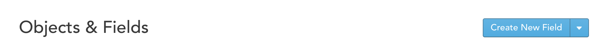

# Create Custom Fields

Custom Fields allow storing custom metadata on any Zaius Object. Custom fields can store a variety of data:

| Type | Notes |
| :--- | :--- |
| Text | Any printable UTF-8 character, including space. Text is limited to 1024 characters. |
| Number |  A number represented in standard decimal format \(Example: `0`, `3.14159`, `-2.3`, `-0.112`\) |
| Date & Time | Must be formatted as ISO 8601 format or UNIX epoch \(seconds since January 1, 1970\). Examples: `1435708800`, `2015-07-01T00:00:00-00:00`, `2015-07-01T12:30:00-07:00`Note: If time and timezone are not provided the time is assumed be 12am UTC. |
| True / False | Must be one of `0`, `1`, `true` or `false` |

## Create Custom Field

 Go to [Account Settings -&gt; Objects & Fields](https://app.zaius.com/app?scope=#/custom_fields) and select **Create New Field:**

